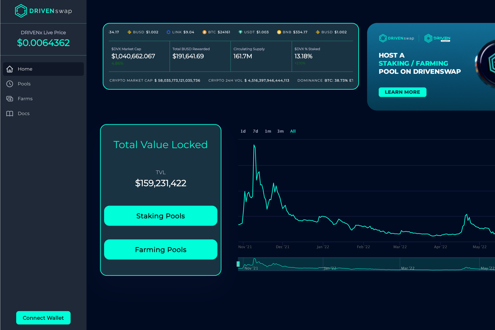

什么是 DRIVENswap？DRIVENswap 是一个平台，允许用户为权益或矿池做出贡献，并以被动方式赚取额外的 DRIVENx 代币。只有通过 DRIVENsecurity 审核的信誉良好的项目才会由 DRIVENecosystem 团队在 DRIVENswap 上列出。什么是单产农业？收益农业也称为流动性挖矿，是一种通过持有加密货币来产生奖励的方式。这只是您通过锁定您的加密货币资产来赚取更多收益的一种方式。什么是质押？质押是在权益证明 (PoS) 区块链（类似于加密挖掘）上积极参与交易验证的过程。任何拥有最低 DRIVENx 需求量的人都可以在这些区块链上验证交易并获得 Staking 奖励。

