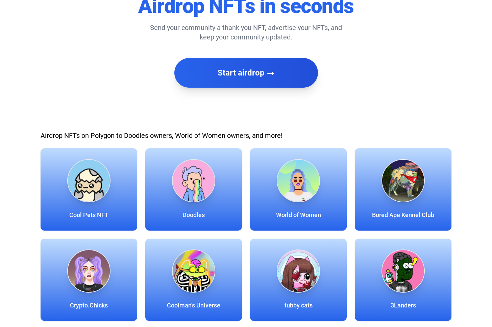

自动化您的 NFT 空投。发送到无限的钱包地址。上传地址的自定义 CSV，或选择我们预先填充的组发送到随机地址。进行大规模赠品，开展营销活动，与您的社区进行安全沟通。 web3 上的营销很有意义。Dropys 是创作者的首选工具，可帮助您轻松向社区空投。Dropys 是一种空投工具，可自动执行空投过程。不再需要手动手动发送交易。你只需要简单的单击一个按钮，然后将您的 NFT 发送到无限数量的钱包。

