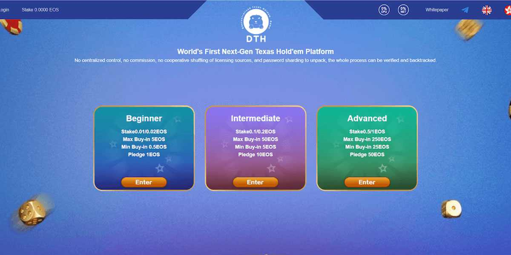

---
title: "DTH (Decentralized-Texas-Hold’em)"
description: "DTH（去中心化德州扑克）"
date: 2022-08-18T00:00:00+08:00
lastmod: 2022-08-18T00:00:00+08:00
draft: false
authors: ["boogArno"]
featuredImage: "dth-decentralized-texas-hold-em.png"
tags: ["Gambling","DTH (Decentralized-Texas-Hold’em)"]
categories: ["nfts"]
nfts: ["Gambling"]
blockchain: "EOS"
website: "https://dtheos.com/"
twitter: "https://twitter.com/DTH_eos"
discord: ""
telegram: ""
github: ""
youtube: ""
twitch: ""
facebook: ""
instagram: ""
reddit: ""
medium: ""
steam: ""
gitbook: ""
googleplay: ""
appstore: ""
status: "Live"
weight: 
lightgallery: true
toc: true
pinned: false
recommend: false
recommend1: false
---
DTH（去中心化德州扑克）是世界上第一个基于 EOS.IO 的下一代德州扑克平台。发牌过程不集中控制，不扣佣金，不合作洗牌，解密过程中引入密码碎片，整个过程可验证和回溯。更多激动人心的 EOS 赢取机会即将到来，快来加入这场绝对公平的德州扑克体验吧！

**DTH (Decentralized-Texas-Hold'em)** dApp 是一种来自**赌博**类别的加密资产，建立在协议。现在，根据用户数量，它在一般 dApp 排名中排名**第 289**位，在**赌博类别中****排名第 578**位，这让您可以很好地了解**DTH（分散式德州扑克）** dApp 在其竞争对手中的表现。

