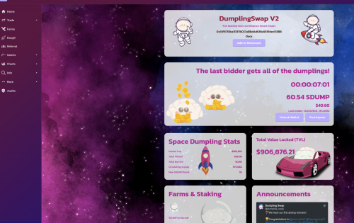

Dumpling Swap 是一个单产农业项目，由一群在 DeFi 领域拥有丰富经验的热情软件开发人员开发。我们的使命是通过提供强大的 DeFi 生态系统来创建一个经济上可持续的单产农业社区，该生态系统想要彻底改变这一领域。除了可靠的代币经济学，我们的团队还在不断添加更多激励代币销毁的功能。

如果您是加密新手，请使用 Crypto.com 大学和我们的帮助中心了解如何开始购买比特币、以太坊和其他加密货币。

要以您选择的法定货币查看 Dumpling Swap 的实时价格，您可以使用此页面右上角的 Crypto.com 的转换器功能。

Dumpling Swap 价格页面只是 Crypto.com 价格指数中的一个页面，其中包含价格历史、价格代码、市值和顶级加密货币的实时图表。

