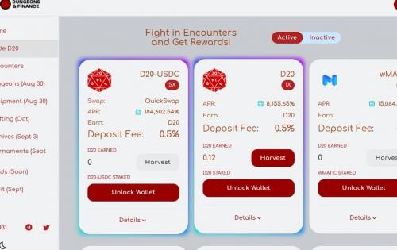

---
title: "Dungeons and Finance"
description: "Dungeons & Finance 正在将角色扮演游戏带到 Polygon Network。在 Encounters 中通过单产农业开始您的冒险之旅，以获得 NFT 设备"
date: 2022-08-18T00:00:00+08:00
lastmod: 2022-08-18T00:00:00+08:00
draft: false
authors: ["boogArno"]
featuredImage: "dungeons-and-finance.png"
tags: ["DeFi","Dungeons and Finance"]
categories: ["nfts"]
nfts: ["DeFi"]
blockchain: "Polygon"
website: "https://app.dungeons.fi"
twitter: "https://twitter.com/DungeonsFinance"
discord: ""
telegram: "https://t.me/DungeonsFinance"
github: ""
youtube: ""
twitch: ""
facebook: ""
instagram: ""
reddit: ""
medium: "https://medium.com/@dungeonsfinance"
steam: ""
gitbook: ""
googleplay: ""
appstore: ""
status: "Live"
weight: 
lightgallery: true
toc: true
pinned: false
recommend: false
recommend1: false
---
Dungeons & Finance 正在将角色扮演游戏带到 Polygon Network。在 Encounters 中通过单产农业开始您的冒险之旅，以获得足够的设备并面对地下城的挑战。
我们是一家独立视频游戏工作室，我们的愿景是将加密货币完全整合到视频游戏经济中，让我们的代币在 Al-Derath 的幻想世界中成为一个用例。
目前，我们正在开发一款黑暗奇幻等距 MMORPG “The Warmag's Lament”，灵感来自 Ragnarok Online、Planescape: Torment 和 Tyranny 等游戏。 《战争法师的哀歌》是我们作家和游戏大师 14 年经验的总结，讲述了在一个魔法可以重塑景观并改变统治者思想的世界中生命脆弱的故事。

