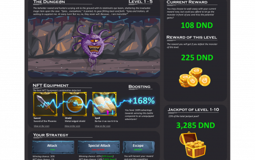

---
title: "DungeonSwap"
description: "DungeonSwap 是币安智能链上一款去中心化的桌面 RPG 风格网页游戏，具有收益农业功能和 NFT 作为战斗装备。"
date: 2022-08-18T00:00:00+08:00
lastmod: 2022-08-18T00:00:00+08:00
draft: false
authors: ["boogArno"]
featuredImage: "dungeonswap.png"
tags: ["NFT Games","DungeonSwap"]
categories: ["nfts"]
nfts: ["NFT Games"]
blockchain: "BSC"
website: "https://dungeonswap.app/"
twitter: "https://twitter.com/DungeonSwap"
discord: ""
telegram: "https://t.me/dungeonswap"
github: "https://github.com/dungeonswap/"
youtube: ""
twitch: ""
facebook: ""
instagram: ""
reddit: ""
medium: ""
steam: ""
gitbook: ""
googleplay: ""
appstore: ""
status: "Live"
weight: 
lightgallery: true
toc: true
pinned: false
recommend: false
recommend1: false
---
DungeonSwap 是币安智能链上一款去中心化的桌面 RPG 风格网页游戏，具有收益农业功能和 NFT。
- 除了收益耕作之外的独特功能是名为“The Dungeon”和“Boss Battleground”的游戏，开发团队正在非常努力地开发它们，并将其作为一项长期功能，使用户满意并获得经济收益。

- 《地下城》是一款“类 Rogue”的网页游戏，玩家可以在深入地下城的过程中与不同的敌人战斗并积累奖励（就 DND 而言），或者保留他们的奖励并退出游戏，这样他们就不会'在该级别上输掉一场战斗，不会冒失去所有奖励的风险。

- 用户持有的 NFT（随机免费分发给副本参与者）将对战斗结果产生积极影响，帮助用户更轻松地赢得战斗。

  