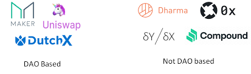

DutchX 是一种去中心化交易协议，允许任何人添加任何交易代币对。它使用荷兰式拍卖原则来防止其他交易所遇到的问题（例如抢先运行、流动性低的问题和第三方风险），创造一个更公平的生态系统供所有人使用。DutchX 由部署在以太坊区块链上的一系列智能合约管理，允许用户之间应用荷兰式拍卖机制进行点对点交易，而无需中介。

它是完全链上且无需许可的。除了在 DutchX 上交易的代币必须符合 ERC20 之外，没有任何限制。

它由 Gnosis Limited 开发，作为以太坊区块链的基础设施。它是可升级的，这些权力由 [dxDAO](https://dutchx.readthedocs.io/en/latest/dxDAO.html) 保留。 Gnosis Limited 不是 dxDAO 的一部分，并且绝对不保留对 DutchX 或影响 DutchX 的任何其他权力。

