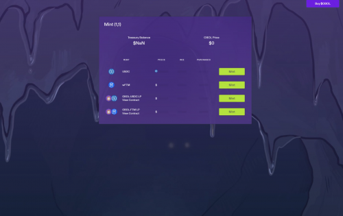

DWorld 是 Fantom 网络上基于 OBOL 代币的去中心化储备货币协议。每个 OBOL 代币都由 DWorld 国库中的一揽子资产（例如 USDC、OBOL-FTM LP 代币等）支持，赋予其不能低于的内在价值。 DWorld 还通过质押和铸造将经济和博弈论动态引入市场。大规模采用加密货币作为支付手段的两大障碍是易用性和购买力波动性。我们在 此向您介绍Celo，这是一种协议,通过基于地址的加密方案和价值稳定的代币来解决这些 问题。我们将展示如何将这些属性结合起来，以促进包括全球参考货币，本地和区域价 值稳定货币以及社会红利在内的货币生态。

