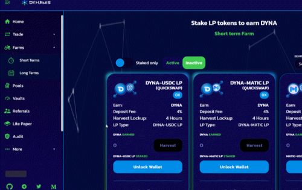

在 Polygon 上运行的全面革命性 DeFI 平台，建立在力量、潜力和能力之上。
这些原则强调了我们对 Dynamis Finance 的愿景——一个让用户通过探索去中心化金融的全部潜力来实现财务自由的地方。更具体地说，我们的目标是创建一个平台，该平台可供具有不同可能性的用户访问，并具有可以满足不同需求和投资策略的功能。在 Polygon 上运行的全面革命性 DeFI 平台。

在 Polygon 上运行的全面革命性 DeFI 平台，建立在力量、潜力和能力之上。经过全面审核和 KYC 的团队。

