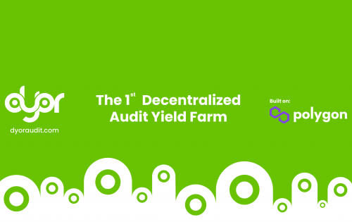

DYOR 审计团队由非常有才华的人组成，他们有着一劳永逸地清理 Crypto 和 DeFi 空间的独特雄心。
我们的团队包括长期在加密货币领域工作的智能合约开发人员和安全研究人员。
鼓励这个想法诞生的共同催化剂 - 让我们的一些团队成员成为拉扯和诈骗的牺牲品。他们所经历的动荡是如此令人心碎，以至于我们决定采取一些措施。
在社区和其他真正合作伙伴的支持下，我们期待在加密货币市场中重新命名合法性！

