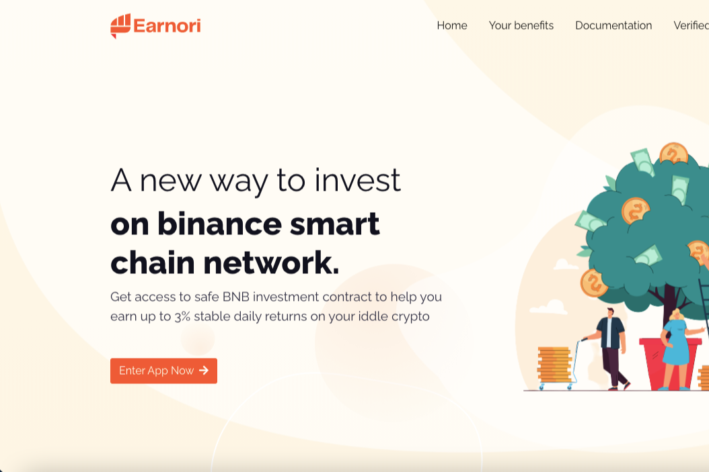

Earnori 是一种在币安智能链网络上投资闲置加密货币的新方式。
Earnori 在币安智能链上自动运行。没有人能够编辑、删除或影响其自主操作。股息也通过智能合约自动支付。
股息分配
智能合约每天根据您的投资产生 3% 的股息，并将您的股息分配到您的余额中。例如，如果您投资 1 BNB，那么您每天将收到 0.03 BNB
推荐计划
3级推荐奖励，分别为5% - 1% - 1%。此外，受邀者还可以获得自己投资的0.1%。奖励将自动分配到您的余额中
验证合同

