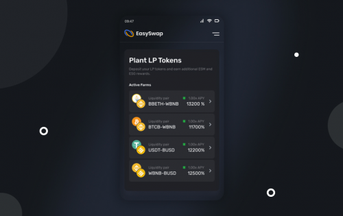

EasySwap 是币安智能链上的自动做市（AMM）去中心化交易所（DEX）和自动策略聚合器。
我们是一个社区运行的项目，由社区投票管理协议中的所有重大变化。我们决定使用 Aragon DAO 来管理项目并增加社区力量。我们在 BSC 上创建了 Aragon DAO 项目的分叉来管理我们的长期项目。您可以使用我们原生的 Easy Swap Governance (ESG) 代币成为我们 DAO 的一部分。
我们的使命是建立具有易于使用的界面的大众市场defi平台。因此我们选择了 BCS，因为以太坊区块链对最终用户来说更昂贵。我们认同区块链技术应该以去中心化的方式工作的愿景，我们将帮助 BSC 更加去中心化。

