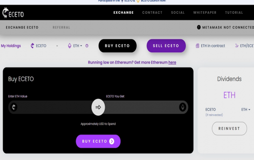

一种产生股息的沙漏合同，促进储蓄和长寿的文化。每次购买或出售时，代币的价值都会通过算法增加和减少，通过每笔交易费用为代币持有者产生红利。在 30 天之前提前退出的处罚。
水晶大象令牌：成为房间里的大象。通过您的 TronLink、Metamask 或兼容的网络钱包将您选择的硬币（TRX、ETH 或 BNB）兑换成 CETO。它没有你想的那么难。
Landing_imgs 每次有人购买 CETO，CETO 的价格就会逐渐上涨。每次有人卖出 CETO，价格都会下降相同的增量。
Landing_imgs当有人进行任何类型的交易时，10% 被取出并按比例分配给每个代币持有者。

