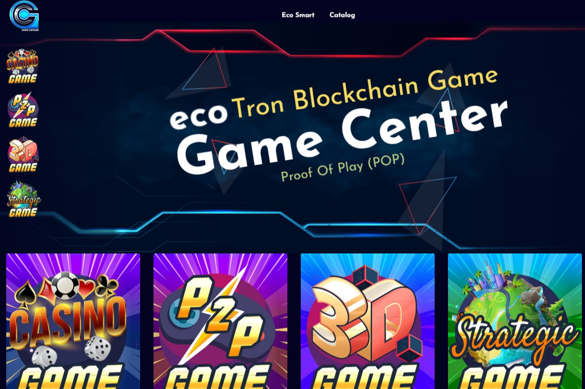

---
title: "ECO Game Center"
description: "在线游戏中的 ECO 游戏中心 Tron 区块链游戏智能合约。"
date: 2022-08-18T00:00:00+08:00
lastmod: 2022-08-18T00:00:00+08:00
draft: false
authors: ["boogArno"]
featuredImage: "eco-game-center.png"
tags: ["Gambling","ECO Game Center"]
categories: ["nfts"]
nfts: ["Gambling"]
blockchain: "TRON"
website: "https://ecogamecenter.com"
twitter: "https://twitter.com/EcoSmartECS"
discord: "https://discord.gg/gntNAA"
telegram: "https://t.me/EcoSmartGameCenter"
github: ""
youtube: "https://www.youtube.com/channel/UCZyavwOXisC7aVVYX8FbnPQ"
twitch: ""
facebook: ""
instagram: "https://www.instagram.com/ecosmart.ecs"
reddit: ""
medium: ""
steam: ""
gitbook: ""
googleplay: ""
appstore: ""
status: "Live"
weight: 
lightgallery: true
toc: true
pinned: false
recommend: false
recommend1: false
---
🎯 这个游戏中心有独特的方法在在线游戏中使用智能合约。它提供了一个基于 ECS 代币 ico 顶部的竞争平台，为使用该平台变得富有的游戏玩家提供收入。 💡 会有很多版块和新游戏不时推出，其中包括：🎲 赌场游戏✅ ⚡️ P2P 游戏✅ 🎮 3D 游戏✅ 🕹 战略游戏✅ 📌由于这个平台的社交性质，无论是 Eco -Smart 和它的用户在平台的发展中拥有自己的份额。用户将受益于成为利益相关者，从推荐中获得收入并获得永久红利。最后一项提供给社区领袖。

