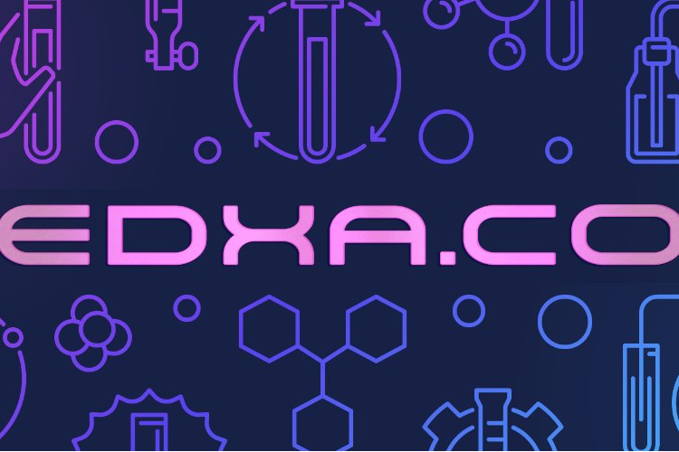

我们是 BSC 上的 DEX AMM。我们设想成为顶级多链 DEX。EDXA Labs 是在币安智能链上运行的去中心化交易所。它的设计使命是提供一个安全的生态系统来激励其社区。他们设想成为 BSC 的顶级多链自动化做市商之一，而不仅限于 fantom、avalance 和 heco。EDXA Labs 是币安智能链上的支付流动性解决方案。我们正在将现实世界的支付与加密货币相结合。我们是 BSC 上的 DEX AMM。我们设想成为顶级多链 DEX,而不仅限于 fantom、avalance 和 heco。EDXA Labs 是币安智能链上的支付流动性解决方案。

