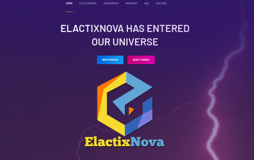

ElactixNova $EXA 是币安智能链上全新的反射协议。该合约将具有独特的功能，并且将是第一个以绝对零税和通货紧缩的方式向持有人介绍反射的合约。
ElactixNova 协议基于具有被动收益机制的代币，该机制不源于转让税。
相反，被动收益率来自新购买订单的供应扩张（代表对代币的有机需求）。作为 ElactixNova 持有者，您为每一个以 $EXA 下达的新购买订单被动赚取更多代币。每次新购买后，您的奖励都会立即“交付”到您的钱包中。
在钱包之间购买或转账时永远不会有任何税收！
预售和发布
预售：4 月 28 日
发布时间：4 月 30 日

