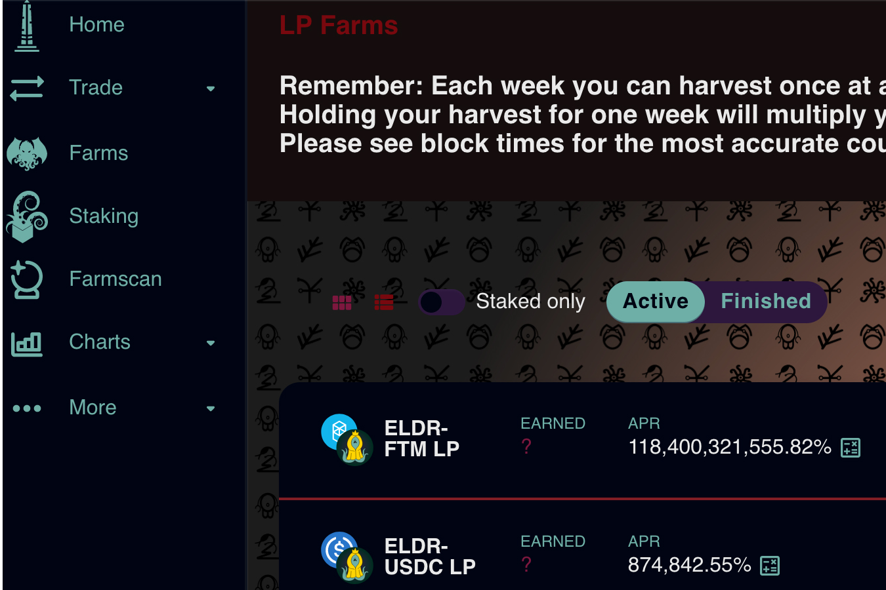

Eldritch Finance 是一种独特的收益优化器，它提供通货紧缩机制，以确保本地代币 ELDR 的供应不断减少。凭借独特的耕种机制，用户可以通过 HODL 乘数来增加收入。每个 epoch 由 1 周组成，允许用户随时收获一次。如果他们选择 HODL 他们的代币，他们可以每周增加他们的收益！

Fantom 链上的通缩收益聚合器。每周收获一次，随时随地。 HODL 让您的奖励倍增
ELDRv2 为持有者提供被动的 ETH 奖励。当汇集最低金额时，ETH 会自动分配。有关更多信息，请参阅我们的文档。

