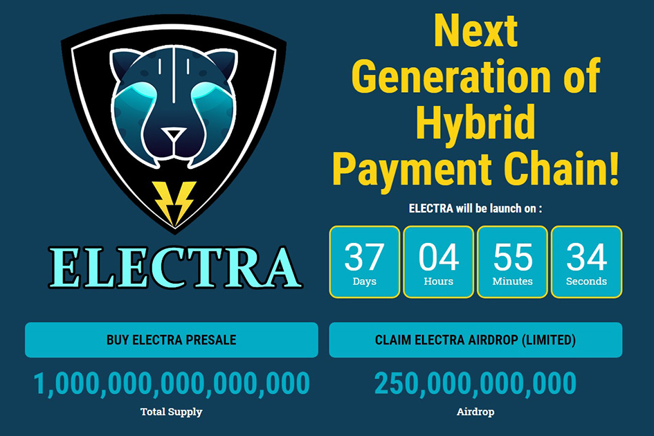

Electra 是一种基于币安智能链 (BSC) 的通货紧缩、社区驱动的 BEP-20 代币。它于 2021 年 5 月 22 日推出。每笔交易都有两个功能：基于币安智能链 (BSC) 的通缩、社区驱动的 BEP-20 代币。我们致力于成为下一代混合支付。
我们致力于成为下一代混合支付链。 Electra 链旨在成为一个用户友好的交易所，具有高 gas 性能、抗审查和零租金提取。它对交易者有利，并且作为其他需要链上流动性保证的智能合约模块特别有效。Electra 是一种基于币安智能链 (BSC) 的通缩、社区驱动的 BEP-20 代币。我们致力于成为下一代混合支付。

