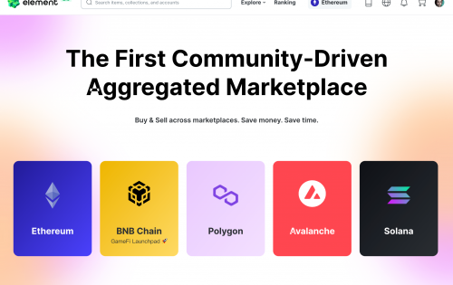

---
title: "Element Market"
description: "Element 是一个用于创建、发现和交换 NFT 的全球去中心化多链市场。"
date: 2022-08-18T00:00:00+08:00
lastmod: 2022-08-18T00:00:00+08:00
draft: false
authors: ["boogArno"]
featuredImage: "element-market.png"
tags: ["Marketplaces","Element Market"]
categories: ["nfts"]
nfts: ["Marketplaces"]
blockchain: ""
website: "https://www.element.market"
twitter: "https://twitter.com/Element_Market"
discord: "https://discord.com/channels/868079217328406548/868079217328406551"
telegram: "https://t.me/elementenglish"
github: ""
youtube: "https://www.youtube.com/channel/UCcv5mKdEMq4jLdiAvmotnSg"
twitch: ""
facebook: "https://www.facebook.com/elementcommunity"
instagram: "https://www.instagram.com/elementmarket_official/"
reddit: "https://www.reddit.com/r/Element_official/"
medium: "https://element-official.medium.com/"
steam: ""
gitbook: ""
googleplay: ""
appstore: ""
status: "Live"
weight: 
lightgallery: true
toc: true
pinned: false
recommend: false
recommend1: false
---
Element作为受资本青睐的新兴NFT交易市场，从创作者、用户、社区三个角度进行设计，旨在帮助大量用户进入NFT市场，促进传统市场与加密经济的融合。
在平台功能方面，Element具有三个主要功能，即：创建、发现和交换。
1. 创建
创造意味着薄荷。
2. 发现
发现意味着搜索。
3. 交流
元素的核心
在产品设计上，Element从上传、存储、交易等各个环节考虑，为艺术创作者提供友好的市场环境。 Element还具有八个功能。
(1) 支持零成本 NFT 铸币
(2) 支持4种主流去中心化存储
(3) 支持 NFT 文件大小
（四）保护创作者权益，禁止恶意机器人竞价
(5) 两种语言版本，优化 NFTs 搜索
(6) 英文拍卖 Gas 费补贴
(7) 最低的交易费用
(8) 跨链互操作性

