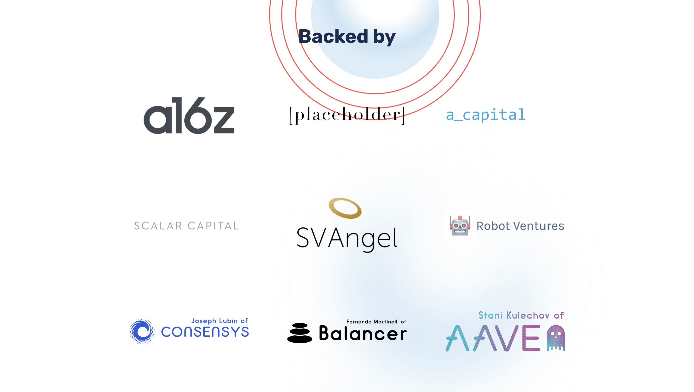

Elementic Finance 是 Polygon (Matic) 网络上的下一代去中心化金融 (DeFi) 和收益农场应用程序。有没有想过工程团队如何建立有效的 PCB 设计流程？这个新系列展示了电子系统设计团队如何构建数字协作线程。探索由专业设计师讲述的 30 个短片。遵循从产品创新到交付的过程。数字技术将产品设计的各个方面结合在一起，简化了从产品开始到制造的整个过程。了解西门子 Xcelerator 产品组合中的 Xpedition flow 如何帮助您的团队解决组织、流程和产品的复杂性。

