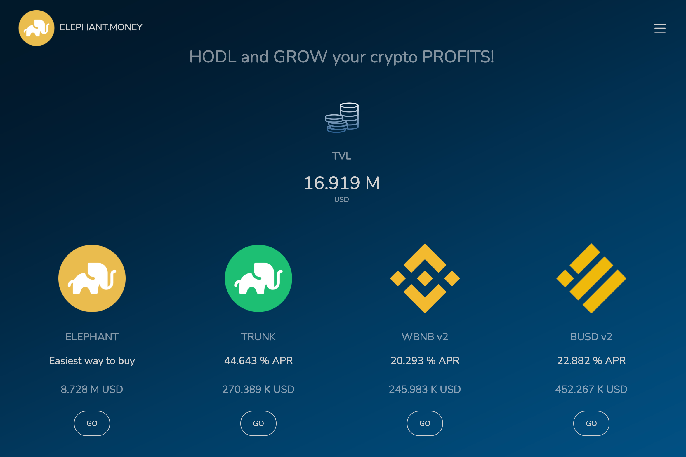

ELEPHANT.MONEY STABLE 是一种永不过时的方式，可让您的投资组合获得复合利润。锁定你的收益。使用 Reserve 铸造 Elephant Money Stable (TRUNK)。铸造和赎回 TRUNK 只需 1% 的低手续费。 TRUNK 以固定的 75% BUSD 和 25% ELEPHANT 进行部分抵押。两种抵押资产都安全地存储在国库中。 1% 的铸造加工费也用于在 Pancake LP 中用 BUSD 100% 返还 TRUNK。
ELEPHANT.MONEY 是一种在 BSC 上复合利润的面向未来的方式。 ELEPHANT 是我们在币安智能链上的价值存储。 ELEPHANT 代币的所有转账都会收取 10% 的交易费，以建立永久的社区信任。这些费用在支付给现有持有人的款项和锁定的流动性之间平均分配。

