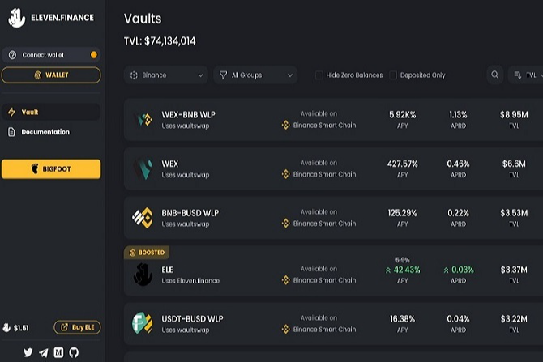

十一金融是一个跨链收益优化生态系统。我们在 Binance Smart Chain 上推出，现在也在 Polygon 上上线。我们努力在每个平台上开发最高 APY 的金库，并通过简化的费用结构将最大的价值回馈给我们的用户。此外，从我们的原生代币 $ELE 持有者的费用中，可以看到回购和销毁机制的好处
此外，我们还有 Bigfoot，我们的杠杆收益农业平台。这使我们的用户可以通过杠杆接触我们的金库和已经很高的 APY。
我们的平台是动态的，旨在利用 Binance Smart Chain 和 Polygon 上的最佳收益，我们快速行动，专注于为两条链构建增值产品，并即将进一步扩展到更多链。

