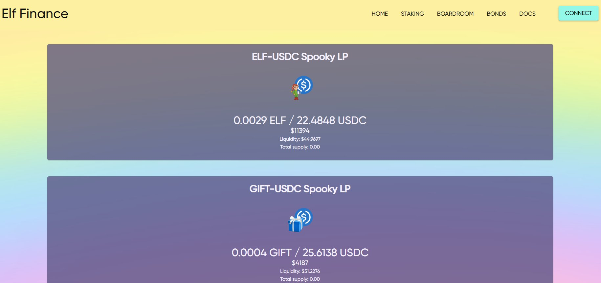

Elf Finance 的灵感来自之前的算法稳定协议，例如 Tomb Finance。就像 2OMB Finance 一样，我们的协议使用三个代币来激励与 $USDC 的稳定 1:1 挂钩。Elf Finance (ELF) 目前按市值排名为#13805 加密货币。今天它达到了 0.000322 美元的高点，现在位于 0.000322 美元。完整的加密货币市场报道，包括491家交易所的18593枚硬币的实时硬币价格、图表和加密市值。只需单击几下，即可将我们的加密货币小部件添加到您的博客、主页或 Wordpress 网站。
我们的轻量级、可定制的小部件让您可以在网络上的任何地方享受最新的价格和图表。
支持超过 18,000 种硬币和各种外观，您一定会找到最适合您的互联网领域的。
