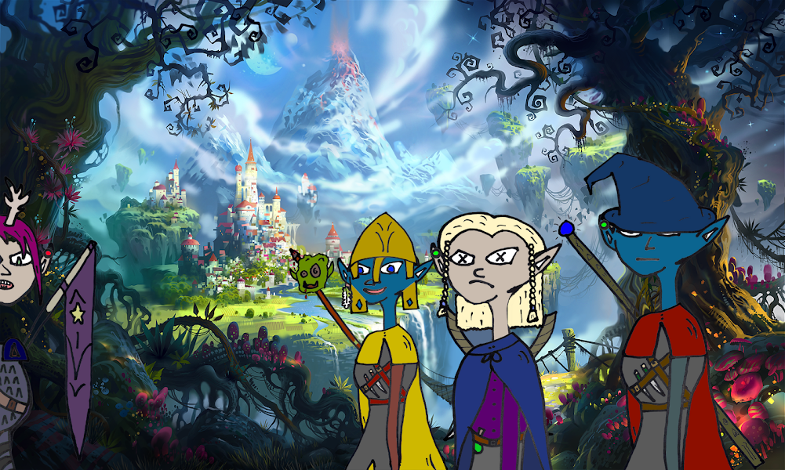

有一个新的精灵镇国王黑暗精灵和高等精灵，这两个古老的哈里斯种族，已经放下了他们的分歧，去征服我们这片土地所面临的最大的邪恶，黑暗精灵和高等精灵，这两个古老的哈里斯种族，已经搁置了他们的分歧，以征服我们的土地所面临的最大的邪恶......地精部落。我们精灵将净化这些土地，这两个古老的哈里斯种族，已经放下了他们的分歧，去征服我们这片土地所面临的最大的邪恶，黑暗精灵和高等精灵，这两个古老的哈里斯种族，已经搁置了他们的分歧，以征服我们的土地所面临的最大的邪恶......地精部落。我们精灵将净化这些土地，

