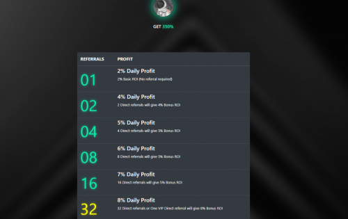

350% 最大投资回报率。
2% 到 8% 的投资回报率取决于推荐奖金。
拥有超过 10,000 TRX 的人将被视为 VIP，并将提高 8% 的投资回报率。
任何邀请 VIP 会员的人都将获得与 VIP 相同的投资回报率 (8%)。Elon Tron 是一个去中心化的项目，允许用户赚取收入。进行首次存款并获得高达 350% 的投资回报。该项目还实施了推荐系统，因此您只需邀请您的朋友即可赚取 2% 到 8% 的收益。通过投资超过 10,000 TRX 成为 VIP，并获得 8% 的投资回报率提升。此外，如果您邀请投资 10,000 TRX 的人，您也将自动获得奖励。

