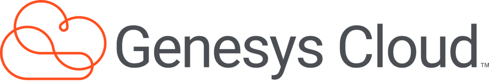

Genesys是一款收益农业应用程序，允许人们投资我们的代币，也可以通过投资我们的池来赚钱。
Genesys的目标是成为最大的产量农场之一，并将随着时间的推移实现不同的功能Genesys Multicloud CX，前身为Genesys Engage和PureEngage，是Genesys的多云呼叫中心软件，可用于所有三大公共云平台-AWS、Azure和谷歌云，部署在公共或私有云环境中。

Genesys Cloud CX，前身为PureCloud，是基于微服务的软件，构建于亚马逊网络服务

PureConnect，前身为客户互动中心或CIC（由Interactive Intelligence开发），是联络中心客户体验管理软件

Genesys DX，预测数字客户参与软件，将客户体验软件（CX）与人工智能相结合

