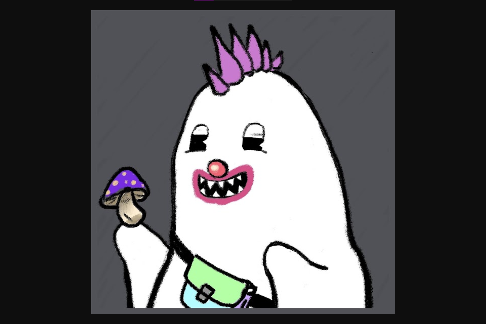

Gh0stly Gh0sts 是第一个真正的全链 NFT。 该集合显示了当前在以太坊主网上漫游的 Gh0st。Gh0stly Gh0sts 对自己的定位是首个全链式 NFT（omnichain NFT），与市面上常见的一些托管型 NFT  跨链桥接方案不同（比如 Wormhole 的原理就是将 NFT 在初始链锁定，再于目标链发行一个 NFT 副本），基于跨链互操作性协议 LayerZero，Gh0stly Gh0sts 实现了多链发行，且可在多链之间实现原子级的跨链转移。

具体来说，Gh0stly Gh0sts 在创世之处就同时支持在七条不同的区块链（以太坊、Polygon、Arbitrum、Optimism、BSC、Avalanche、Fantom）上 mint，这意味着 7710 个幽灵实际上会分布在七条不同的链上，所以其真实地板价需要全部七条链的市场情况（这也是为什么前文我们在说地板价时会加一个 “OpenSea，以太坊”）。

根据出生地的不同，这些幽灵图像的背景颜色还会有所不同。

