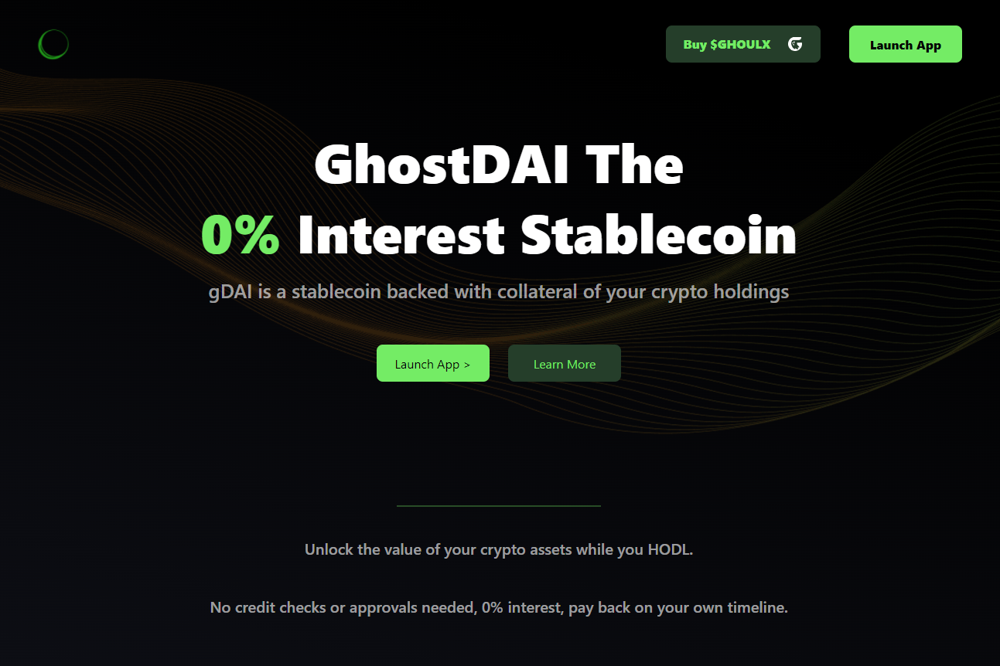

GhostDAI ($gDAI) 是一种稳定币，以您持有的加密资产为抵押品。 您可以将您的加密资产添加到个人保险库中，并在 gDAI 中借入其价值的 2/3。 花费你的 gDAI，将它们换成其他稳定币，将它们添加到农场或将它们换成其他代币。 无需信用检查或批准，利息为 0%，您可以按自己的时间表偿还。
$GhoulX 是 Ghoul.finance 的 gDAI 稳定币协议的治理代币
$Ghoul 是 Super DAO 治理和实用代币，用于对更广泛的食尸鬼生态系统的总体方向进行投票。 食尸鬼质押者获得生态系统内构建的现有和新产品的治理代币。

