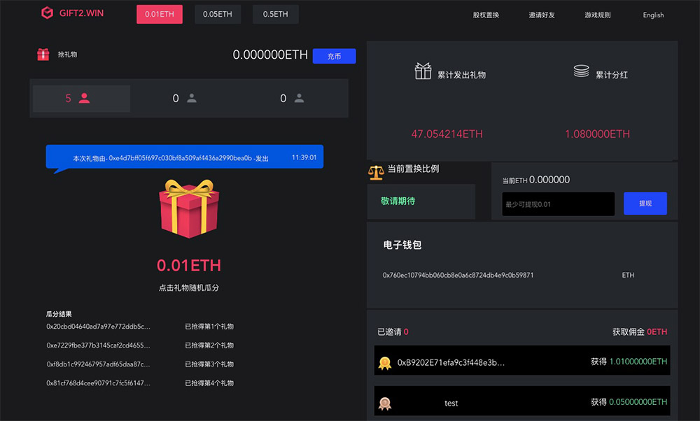

礼物是一款运行在以太坊上的多人互动礼物游戏。 在礼物游戏的回合中，只需点击礼物即可获得它。 当5个礼物名额结束时，下一轮礼物游戏将自动抢最低礼物。Gift2.win 是一个赌博项目。 该平台建立在以太坊区块链上。 当礼物出现在屏幕上时，您只需打开它即可收到礼物。 一旦5个礼物被覆盖，新的一轮就开始了。 回合将从最低礼物开始。礼物是一款多人互动的礼物游戏，互相之间打开互相赠送的礼物，新一轮的游戏回合中你只需要点击即可。

