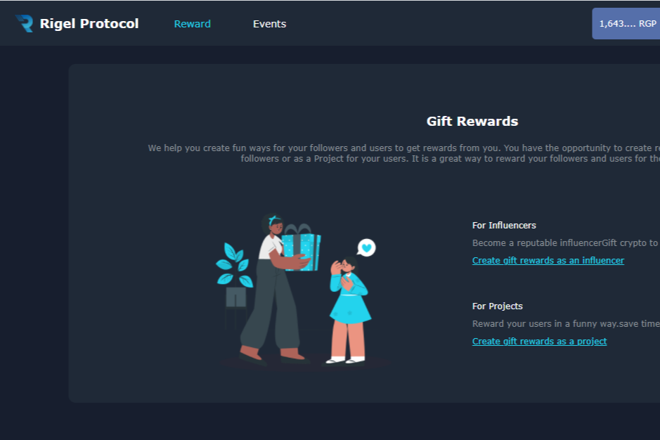

DeFi 项目可以使用这个 Dapp 来奖励他们的社区。 社交媒体影响者可以通过向订阅者发送奖励来大幅增加他们的追随者基础。
用户有机会赢取不同价值的 RGP 代币和其他兼容代币，并购买“旋转”作为礼物送给其他用户。
Defi 项目可以申请利用 Gifting Dapp 在他们自己的用户群和其他加密社区中奖励和推广他们的平台。

挑选完美的礼物需要大量的精力、体贴和现金。但是，如果我们告诉您有一种方法可以减少时间和成本呢？请允许我们向您介绍送礼应用程序的美妙之处，这些应用程序可帮助您为任何场合寻找、策划和交付定制的礼物。无论是您重要的其他人的生日、母亲节还是任何中间的假期，相信这九款送礼应用程序会引导您轻松完成整个过程。

