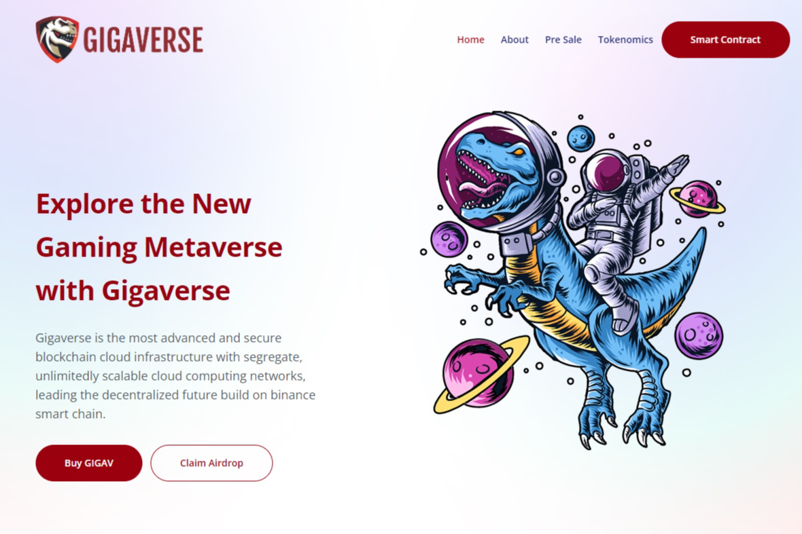

使用 Gigaverse 探索新的游戏元宇宙。 Gigaverse 是最先进、最安全的区块链云基础设施，具有隔离、无限可扩展的云计算网络，引领基于币安智能链的去中心化未来。megaverse（复数megaverses）（物理学）一个原本的高阶宇宙，其中包含多个（可能是无限数量的）宇宙宇宙。
✅ 核心团队全员
✅ 审核中（Solidproof）
✅ 智能合约代码验证
🔒 锁定 LP 池
🔥 100% 烧毁
🚀预售开始日期：2021年12月5日
🚀发布日期：2021 年 12 月 26 日
💰参考获得BNB + GIGAV奖励

megaverse（复数megaverses）（物理学）一个原本的高阶宇宙，其中包含多个（可能是无限数量的）宇宙宇宙。

