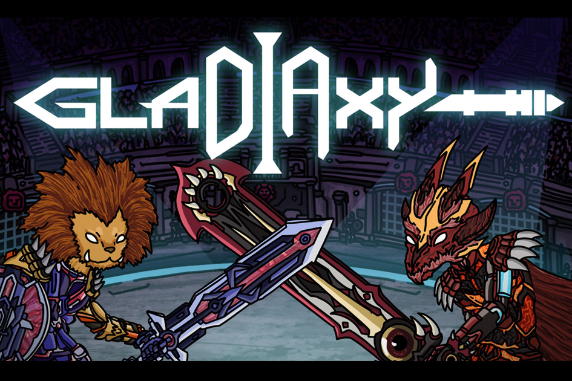

---
title: "Gladiaxy"
description: "Gladiaxy是以太坊上的一个10000 2D动画NFT化身DAO项目"
date: 2022-08-18T00:00:00+08:00
lastmod: 2022-08-18T00:00:00+08:00
draft: false
authors: ["boogArno"]
featuredImage: "gladiaxy.png"
tags: ["Collectibles","Gladiaxy"]
categories: ["nfts"]
nfts: ["Collectibles"]
blockchain: "Optimism"
website: "https://dappradar.com/"
twitter: "https://twitter.com/gladiaxy_meta"
discord: "https://discord.gg/5ymU4uvqGR"
telegram: ""
github: ""
youtube: "https://www.youtube.com/channel/UC_xg2Bk2BvLXfgfbCiDmo-g"
twitch: ""
facebook: ""
instagram: ""
reddit: ""
medium: "https://medium.com/@gladiaxy"
steam: ""
gitbook: ""
googleplay: ""
appstore: ""
status: "Live"
weight: 
lightgallery: true
toc: true
pinned: false
recommend: false
recommend1: false
---
Gladiaxy是乐观以太坊上的一个10000 2D动画NFT阿凡达DAO项目，旨在通过Web3、匿名虚拟社会地位、AI游戏和正念建立一个社区，使社会免于偏见、不公正和不平等。
Gladiaxy NFT允许您有权参与即将举行的活动，即私人空间、治理令牌空投、DAO和各种迷你游戏，包括竞技场战斗、打造更强大的化身以及收集升级材料。Gladiaxy NFT的所有者有权成为“联合角斗士”，其收益相当于联合创始人。当角斗士产生收入时，共同角斗士将获得他们的收入份额。在我们计划的最后阶段，我们将为2D NFT所有者创建一个元宇宙，允许他们导入NFT，并让他们在我们的3D世界中生活。您可以通过我们的人工智能培训进行社交、玩迷你游戏或增强NFT的智能。

