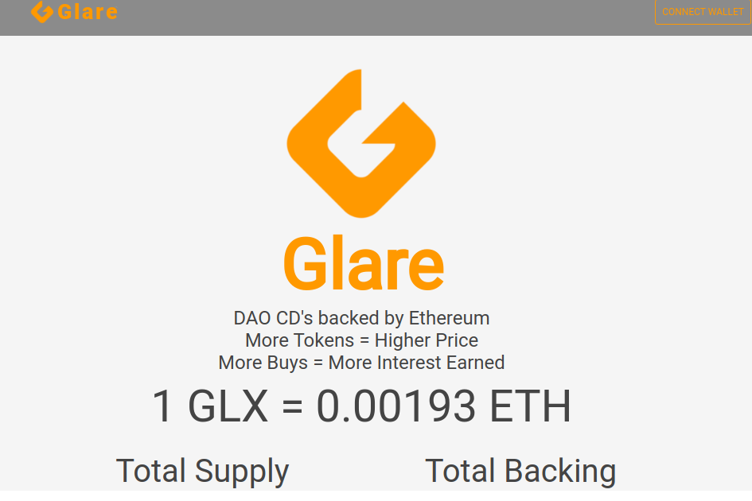

Glare 是运行在以太坊区块链上的智能合约。 Glare Token (GLX) 的主要组成部分。

Glare 代币 100% 由以太坊支持。*以太坊*是一个全球性的、去中心化的金融和新型应用程序平台。在*以太坊*，我们可以通过代码来控制资产，并建立世界上任何地方皆可访问的应用程序。 铸造的每个代币都会增加代币的价格。 GLX 对自动存储在眩光合约中的 ETH 保持 100% 的流动性。

铸造眩光并将资金锁定在 CD 合约中，以赚取眩光生态系统活动的红利。

