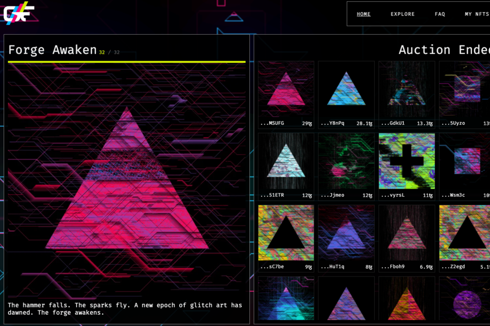

类似于Artblocks或FXHash，它使用事务哈希来确定艺术品-Glitch Forge是一个精心策划的平台，创建项目时利用高分辨率图像库，结合自定义代码应用程序或流程，在收藏者出价时创建艺术品。有趣的竞价机制游戏帮助策划项目，探索在平台上创建的项目，同时创建高质量的艺术NFT。
设计为一个持续的平台，让艺术家和编码人员创建协作项目（与Async.art不同）-开放式设计方法意味着在故障介质中实现新颖独特的创意艺术项目。创建的NFT应能够通过OBJKT进行买卖。com正在等待合同批准。

