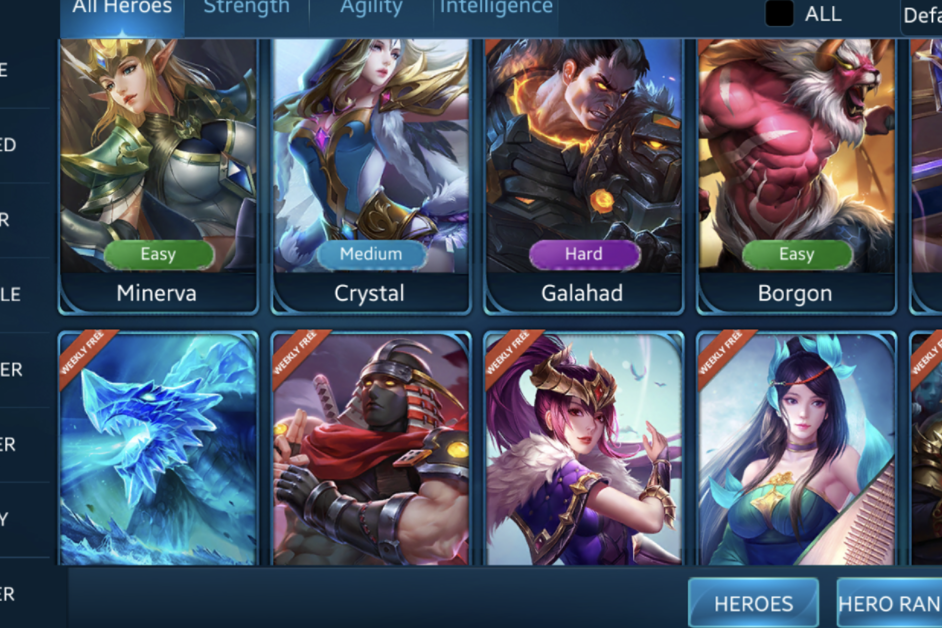

GamerShiba的目标是创建一个完整的RPG游戏元世界，让数百万人以轻松的方式加入基于NFT和区块链的游戏世界。没有开发钱包，没有营销钱包。买入费5，卖出费-%3给Liquidity，2给持有人-专为鲸鱼和鹬类设计我们希望使探索、跟踪和管理分布式应用程序对所有人都有深刻的见解、方便和回报。
我们从2018年开始，为全球受众带来了关于分散应用程序的高质量、准确的见解，并迅速成为值得信赖的行业来源。
今天，我们是dapp发现的起点-托管来自48个协议的11981个dapp-提供全面的NFT估值和投资组合管理，并在数据导向、可操作的行业报告方面处于领先地位。

