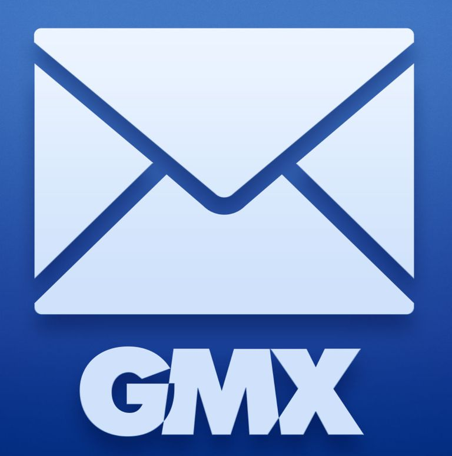

GMX 是一种链上永续期货和可组合的现货交易协议，允许交易者直接从自己的钱包执行高达 30 倍的交易。 GMX 采用领先的加密资产 (GLP) 的多资产流动性池来执行和结算交易。 GMX 利用包括 Chainlink 在内的领先预言机来提供透明的零价格影响交易。 这导致了一个无摩擦且资本高效的资产池，可在所有市场条件下实现可持续的高收益。在设备上存储和/或检索信息个性化广告和内容、广告和内容衡量、受众洞察和产品开发您可以随时通过单击我们网站底部的数据保护来调整您的设置。

