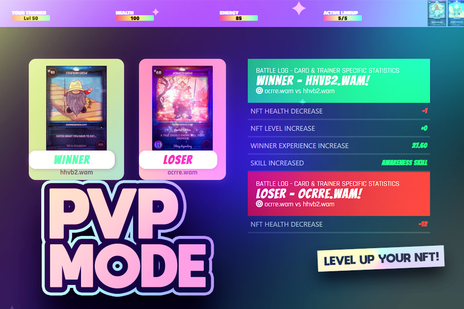

GNO City 是一款允许玩家升级他们的 NFT 并建立他们的元节生活方式的游戏。 通过升级来增加您的 NFT 收藏。 去对抗城里的人。 获得诸如 GNOKEN、经验和其他物品的奖励。 炫耀您的最高级别 NFT。WAXCON 2022 - 11 月 15 日至 19 日在 LandBox 举行！赢得一个电脑挖矿包@landboxio.1) 转推2) 评论和标记 3 #NFT 朋友或收藏3) 了解更多关于 http://waxcon.io看起来很酷！ 我们有时间准备到 11 月！该数据代表被跟踪智能合约的原始链上活动

