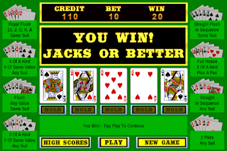

Go Poker 是一个基于 EOS.IO 协议的去中心化德州扑克游戏平台。 Go Poker 提供专业水平的游戏体验。 支持的钱包包括 Scatter 和 Token Pocket。GGPoker 是世界上最大的扑克网站之一，拥有令人难以置信的锦标赛日程。

您会发现从流行的扑克变种（例如 Texas Hold'em 和 Omaha ）到独家和独特的游戏（例如 Flip & Go、Spin & Gold 和 All-In or Fold ），应有尽有。

玩家可以每天从多个锦标赛中进行选择。 GGPoker 的每个人都能找到适合自己的东西，提供免费赛和豪客锦标赛。如果您喜欢玩在线扑克，或者即使您不熟悉在线扑克，也有适合所有口味的游戏，有多种赌注可供选择。

