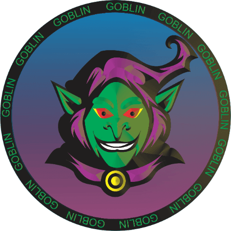

在这个基于 Fantom 链的 DeFi 平台上安全赚钱，2021 年最好的链！我们将创建一个安全和自动化的平台，用户可以在该平台上质押他们最喜欢的 LP 来赚取 Goblin。 我们还在 Fantom 链上提供最佳收益率。Goblin Finance 将实施 Fantom 中最常用的代币：BOO、WFTM、ETH 和 BTC。设想基于 Goblin 的 NFT Marketplace 将于 2 月中旬发布。欢迎来到哥布林财经FANTOM 上的第一个算法稳定币，通过铸币税与 1/1000 TSHARE 的价格挂钩。共享时价：FTM 821.2569264.71 美元

