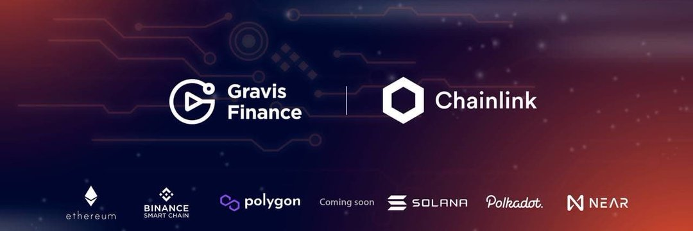

先进的多链 AMM DEX、流动性迁移、农场、NFT。 简单漂亮的用户体验/用户界面​

我们将于世界标准时间 4 月 20 日下午 1 点启动 GRVS 质押🔥🔥🔥

👉利润：

45 天锁定 – 25% 年利率
90 天锁定 – 50% 年利率
180 天锁定 – 75% 年利率
365 天锁定 – 100% 年利率

获得更多 GRVS 的好机会，不是吗？

Gswap - Gravis Finance 的多链 AMM DEX，它结合了强大的功能、简单的界面和先进的#DeFi 功能：从其他交易所的流动性迁移、质押、收益耕作和自动耕作。

