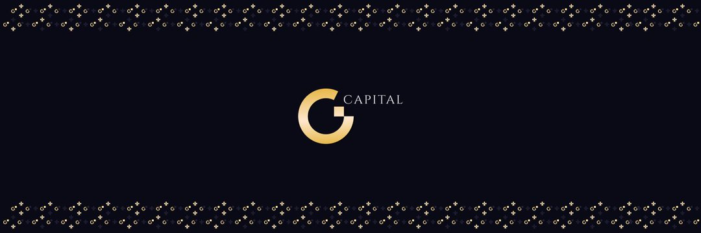

---
title: "GTONCapital"
description: "是一个创建 DeFi 基础设施并构建生态系统的 DAO
使用 $GTON 推进数字资本市场的产品
作为算法治理代币"
date: 2022-08-18T00:00:00+08:00
lastmod: 2022-08-18T00:00:00+08:00
draft: false
authors: ["boogArno"]
featuredImage: "gtoncapital.png"
tags: ["DeFi","GTONCapital"]
categories: ["nfts"]
nfts: ["DeFi"]
blockchain: ""
website: "https://dappradar.com/"
twitter: "https://twitter.com/GtonCapital"
discord: ""
telegram: "https://t.me/GC_community"
github: "https://github.com/GTON-capital"
youtube: ""
twitch: ""
facebook: ""
instagram: ""
reddit: ""
medium: ""
steam: ""
gitbook: ""
googleplay: ""
appstore: ""
status: "Live"
weight: 
lightgallery: true
toc: true
pinned: false
recommend: false
recommend1: false
---
⚜️GTON CAPITAL (𝔾ℂ) 是一个🏛 DAO，它创建 DeFi 基础设施并构建产品生态系统以推进数字资本市场。
⚜️GC 结合了几个相互加强的 DeFi 协议，旨在对流动性和交易量进行算法治理。 ? 🏛 𝔾ℂ DAO 使用 Pathway 和 DAO 治理来确定一组应该影响 GTON 代币定价的基本指标，并建立一个放大和维持这种相关性的做市系统。DAO 代币 $GTON 的挂钩与根据基本指标的基础，例如流动性、锁定的总价值、数量、用户数量、贡献者、合作伙伴关系和集成。
⚜️🏛𝔾ℂ DAO 治理 𝔾ℂ 生态系统，通过提案投票做出决策，GTON 作为治理代币。 $GTON 由不断增长的国库支持，该国库通过 🪢bonding 产生收入。我们每月发布一次财政部报表报告，以跟踪 DAO 拥有的资产和流动性。

