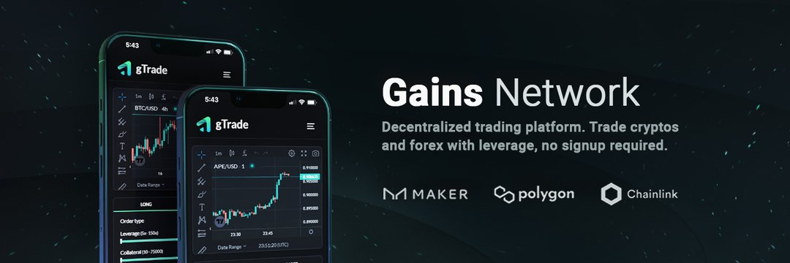

$GNS 为 Polygon 带来了去中心化的杠杆交易。
- 加密高达 150 倍
- 外汇高达 1000 倍
- 最具流动性效率
- 没有资金费用
- 保证止损
- 现货价格中位数（无骗局）
- 自定义#Chainlink DON

1. 新西兰元/美元 ➔ 1090 万美元的交易量
2. SOL/USD ➔ 939 万美元的交易量
3. 美元/加元 ➔ 849 万美元的交易量
4. MATIC/USD ➔ 655 万美元的交易量

gTraders - 让我们知道您对下周的预测！ 🍏👇

✅ 为 $DAI 保险库提供流动性
✅ 为 $GNS/$DAI 池提供流动性
✅ 持有 Gains NFT 并在 gTrade 上运行机器人
✅ $GNS 单边质押赚取 $DAI（很快）
✅ 加入推荐计划以赚取 $GNS（很快）

