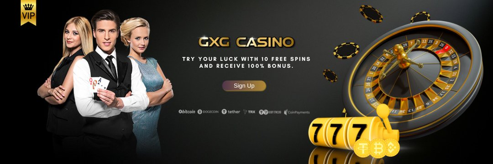

---
title: "GXG"
description: "什么是 GXG 代币？
GXG 代币是基于 BSC 区块链发行的加密股票。 该代币是 gxgbet.com 的数字资产。 GXG是股权代币"
date: 2022-08-18T00:00:00+08:00
lastmod: 2022-08-18T00:00:00+08:00
draft: false
authors: ["boogArno"]
featuredImage: "gxg.png"
tags: ["Gambling","GXG"]
categories: ["nfts"]
nfts: ["Gambling"]
blockchain: "BSC"
website: "https://dappradar.com/"
twitter: "https://twitter.com/gxgtoken"
discord: ""
telegram: ""
github: "https://github.com/GXGcoin"
youtube: ""
twitch: ""
facebook: ""
instagram: ""
reddit: ""
medium: ""
steam: ""
gitbook: ""
googleplay: ""
appstore: ""
status: "Live"
weight: 
lightgallery: true
toc: true
pinned: false
recommend: false
recommend1: false
---
赌博业每秒钟都在增长——由于这种炒作，赌博网站的数量也在增长。但可悲的事实是，它们之间并没有太大区别。博彩公司在广告上投入了大量资金，但在玩家身上却没有。看起来几乎不可能提供新的和独特的东西。
GXG找到了终极解决方案！我们已经对我们的公司进行了代币化。我们独特的代币是加密共享。我们最终决定将赌场净利润的 65% 分配给 GXG 代币持有者。玩家通过在赌场下注，自动从奖励系统基金中获得 GXG 代币。奖励系统基金将向玩家发放总计 50,000,000 个代币。任何持有 GXG 代币的人都会立即成为赌场的股东。作为股东，他们在 GXG 加密货币中获得稳定的每日收入。
我们运行一个开放、安全、透明的代币经济模型。 GXG 代币建立在币安智能链网络之上。我们将预售500万个代币，所有销售金额将购买到BNB，相应比例的GXG代币将进入流动性池。
50,000,000 枚 Token 将注入矿池。用于向代币持有者支付奖金。赌场总净收入的 65% 将用于每天从市场上回购 GXG TOKEN。所有回购的GXG代币将实时注入矿池。我们这样做的目的只是为了给玩家分配更多的收入，毕竟他们是赌场的最大贡献者。
在 GXG 平台上质押 GXG 代币的玩家将获得 35% 的 APY。在 GXG 平台上拥有 Yield Farming LP 代币的玩家将获得 356% + 35% 的 APY。代币奖励可随时提取，无需下注。
立即加入 GXG I-gaming 平台，开始赚取高达 400% 的 APY。

