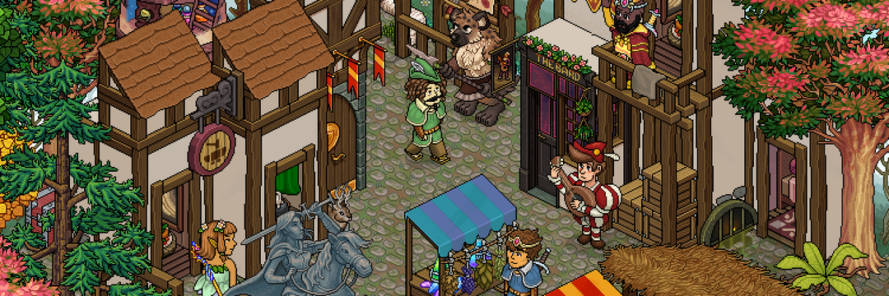

Habbo Avatars 是 Sulake 为 Habbo 制作的第一个官方 NFT 系列。 它由 Habbo 艺术团队手动策划的 12,500 个独特的、自动生成的、像素化的化身组成。 化身是 NFT，存在于以太坊区块链（什么是区块链技术？是一种高级数据库机制，允许在企业网络中透明地共享信息。 区块链数据库将数据存储在区块中，而数据库则一起链接到一个链条中。 数据在时间上是一致的，因为在没有网络共识的情况下，您不能删除或修改链条。 因此，您可以使用区块链技术创建不可改变的分类账，以便跟踪订单、付款、账户和其他交易。）上。 查看我们网站的路线图，了解我们的收藏计划。Habbo：一个奇怪的地方，有很棒的人

