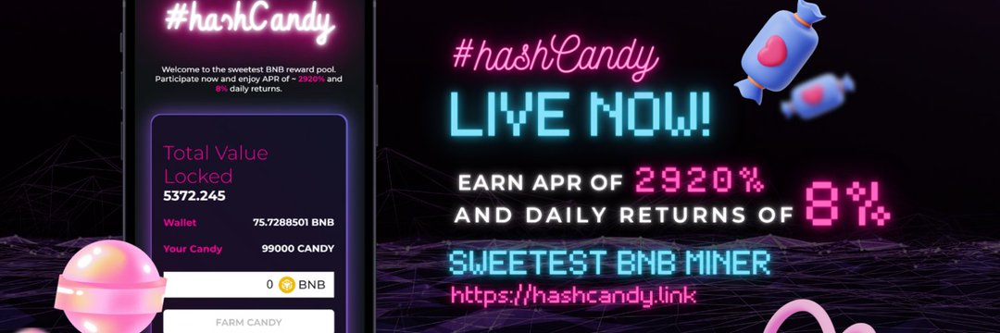

最甜蜜的 BNB 奖励池，每日 8% 的回报。

你好世界！ 👀✨
欢迎来到最甜蜜的 BNB 矿工 HashCandy 😋
每天赚取 8% 的回报！ 😻

达达！ 我们在短短 2 天内锁定了 10 BNB+ 总价值😻✨
继续爱，继续支持🍭❤️

这是 Golden Green Team 帮派的另一个令人印象深刻的压力。这就是我们对他们的 Candy Kush Hash 的看法。

 外观/结构
所以，如此柔软、美丽的哈希，带有深巧克力色的棕橙色，真的很好看。它很粘但仍然很干净，当我玩它时不会在我的手指上留下打滑的东西。如果我用火焰靠近它，它会有很好的油性光泽，像疯了一样的气泡。便于使用。

 气味/味道
如此浓郁的气味，土木，深沉。有点不耐烦，但它也有这种浓郁、果味、松树的味道，一波一波地涌来，我只是不停地闻它，试图猜测发生了什么。这就像一个他妈的整个体验只是闻到它。味道很好，有点落后于气味，但仍然存在。烟雾真的很饱满，光滑，奶油味，真的让那股苦涩的柠檬松树很好地散发出来。

