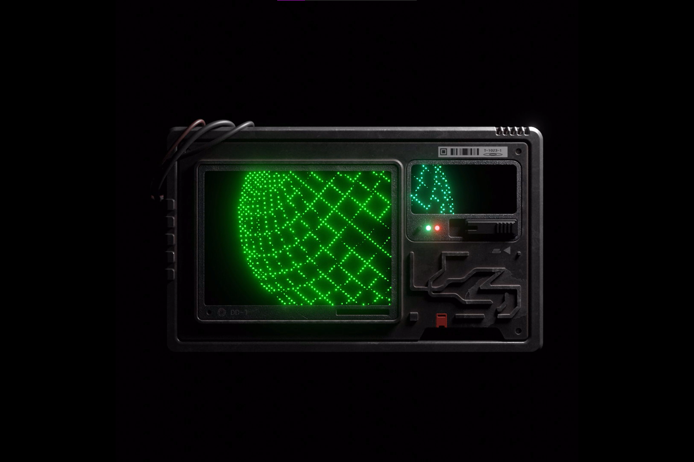

Phases 是 haus 官方制作的作品，每个月我们都会分享不同的艺术家和特色，持有者可Haus 的 hausphases 是 @haustwts 创建的 drop 集合中的第一个项目 drop。 hausphases 是一个包含 7,777 个“阶段模块”的版本，每个月都可以兑换与 Haus 的另一位艺术家合作创作的个人作品。 一旦更换了相位模块，它就会被烧毁，随着时间的推移会耗尽最初的 7,777 个供应。

持有阶段模块还有其他好处，例如能够获得 haus 计划推出的未来代币。 赚取代币的持有者将能够赎回和质押它们。 此外，未来将有独家阶段，这些阶段仅适用于具有特定（当前未确定）阶段模块数量的持有者。以将 Phases 模块换成独一无二的作品。

