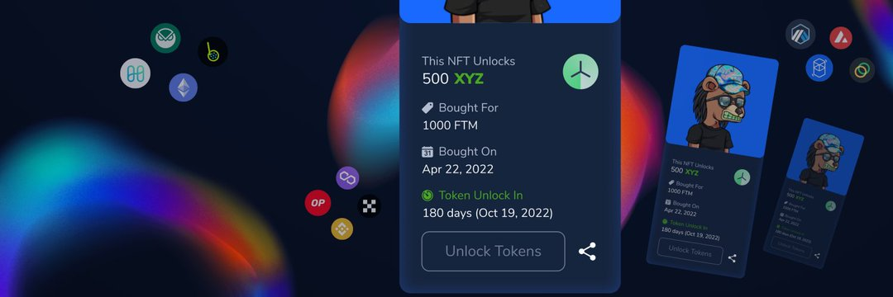

Hedgey Finance Protocols 允许任何代币自行创建期权市场，允许社区、DAO 国库、代币团队和机构无缝交易看涨期权并在非托管点对点机制中投放他们最喜欢的代币。 一个惊人的好处是，Hedgey 的智能合约允许财务团队通过有担保的看涨期权销售获得原生代币多样化，而社区投资者则可以对他们最喜欢的代币进行杠杆押注。 没有上市要求，任何用户都可以自行创建期权市场并立即开始与社区中的其他同行进行交易。

