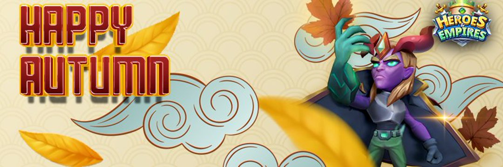

Heroes & Empires是一款Play-2-Earn策略游戏，结合了Idle RPG的独特元素和自走棋的战术，并与区块链技术相连接。 该游戏是在 Unity 引擎上开发的，具有现代游戏玩法、区块链集成和高端图形，将其与其他游戏区分开来。 英雄与帝国将在 PC 和移动设备上兼容，为玩家带来最佳体验。
HE 是用于：

- 玩游戏赚取的奖励。
- 游戏内费用。
- 用于治理投票以确定游戏更改/更新。
H&E 功能包括：
- PvE：Campagin、疯狂塔、任务系统。
- PvP：竞技场。
- 英雄升级：升级、提升
- NFT销毁：融合同类型英雄升级。
- 市场：交易 NFT
- 未来更新：地牢试炼、赏金猎人、神之矩阵、锦标赛、盛大锦标赛、部落战争、NFT 装备等。

