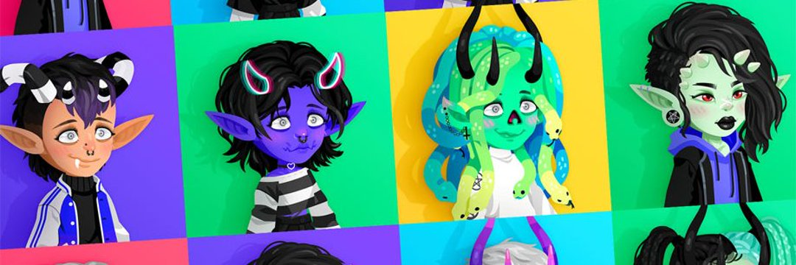

Highrise 是一个移动虚拟世界，每月有 150 万活跃用户。 Highrise Creature Club 是 Highrise 的第一个 NFT 系列。 每个生物都由独特的手工制作的物品组成，可以在高层元宇宙中单独佩戴。 Highrise 拥有超过 1300 万会员，正在通过区块链将数字所有权带入领先的移动优先虚拟世界。 每天，高层居民都会创建房间、风格化身、交易物品、主人体验等等。是时候换个新发型了……或者几个。 我们的 HairRise Redux 活动明天开始！ 我们将展示数十种全新的用户设计的头发物品以及我们的员工在那里投入的一些惊喜👀

