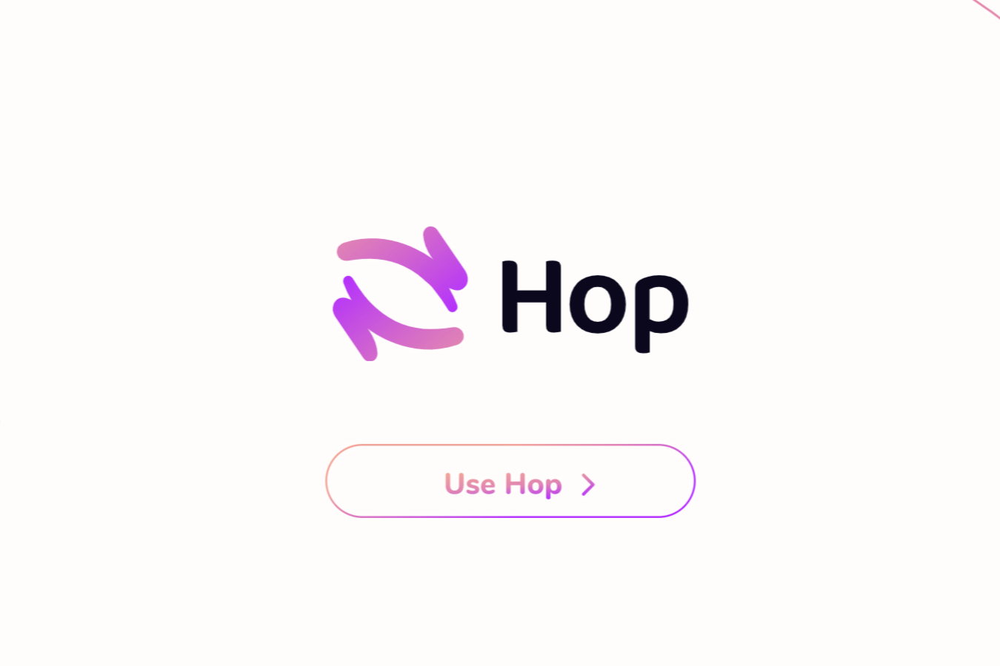

Hop 是一个可扩展的 rollup-to-rollup 通用令牌桥。它允许用户几乎立即将令牌从一个汇总发送到另一个汇总，而无需等待汇总的挑战期。

一种以快速且无需信任的方式跨汇总及其共享的第 1 层网络发送令牌的协议

Coinbase Wallet 用户现在可以直接在浏览器扩展中桥接 @ethereum 和 @0xPolygon 之间的资产

✅ 更少的步骤
✅ 更少的 dapp 连接
✅ 无 Coinbase 费用*

*只在有限的时间。网络费用仍然适用。

今天的**Hop Protocol 价格**为 0.156856 美元，24 小时交易量为 569,986 美元。HOP 价格在过去 24 小时内下跌 -11.5%。它的流通供应量为 4100 万个 HOP 代币，总供应量为 10 亿个。如果您想买卖 Hop Protocol，MEXC Global目前是最活跃的交易所。

